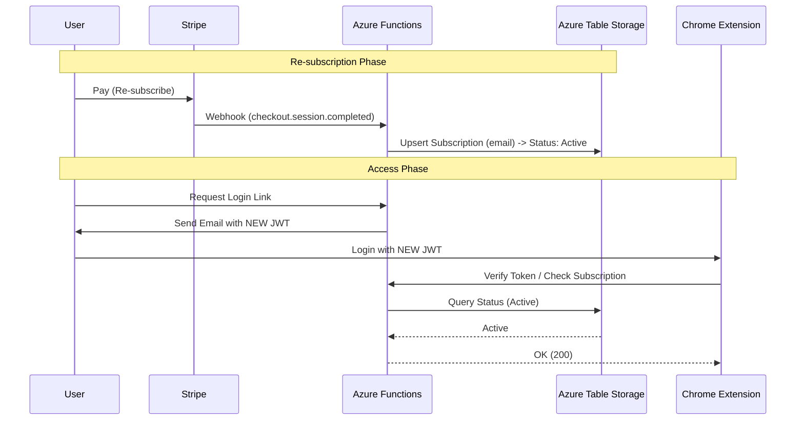

# Re-subscription & Token Management Specification

## Overview
This document defines the system behavior when a cancelled user re-subscribes to the service. The guiding principle is **"New Token Issue + Existing User ID Persistence"**.

## Core Policy
1.  **User Identity**: Unique users are identified by their `email` address. This is the primary key in the database (`Users` and `Subscriptions` tables).
2.  **Re-subscription Handling**: When a former user re-subscribes, they retain their `email` identity (and thus any server-side data linked to it), but the system generates a FRESH authentication token.
3.  **Token Management**: Old tokens are NOT reactivated. A new JWT is issued upon successful re-subscription (or login).

## Workflow

### 1. Subscription / Re-subscription Flow
1.  **Stripe Checkout**: User completes payment on the Landing Page.
    -   *Input*: Email address (must match previous if they want valid data linking).
2.  **Stripe Webhook (`checkout.session.completed`)**:
    -   Azure Function `stripe-webhook` receives the event.
    -   **Action**: Calls `upsertSubscription(email, ...)`
    -   **Behavior**:
        -   If `email` exists: Updates the record with new `status='active'`, new `stripeSubscriptionId`, and new `currentPeriodEnd`.
        -   If `email` is new: Creates a new record.
    -   *Note*: The current `upsert` logic correctly handles this by overwriting the cancellation status with the new active status.

### 2. Token Issuance
1.  **Login / Magic Link**:
    -   After payment, the user is redirected to the "Registration Complete" page (or uses the Login page later).
    -   They request a Magic Link via `auth-send-magic-link`.
2.  **Token Generation**:
    -   The backend generates a **NEW** JWT signed with `JWT_SECRET`.
    -   Payload includes: `{ email: 'user@example.com', iat: ..., exp: ... }`.
    -   *Crucial*: No reference to old tokens is made. The new token is valid because the underlying Subscription table now says `status: 'active'`.

### 3. Client-Side Handling (Chrome Extension)
1.  **Token Storage**:
    -   The extension receives the new token via deep link or manual entry.
    -   `AuthManager` overwrites `chrome.storage.local.authToken` with the new value.
2.  **Data Persistence**:
    -   **Local Data** (Templates, Agents): Stored in `chrome.storage.local`. Since this checks `authToken` validity but doesn't wipe data on logout/cancellation automatically (unless explicitly coded to "Clear All"), user data remains safe.
    -   **Server Data**: If we implement server-side sync in the future, it will be queried using the `email` from the new token, ensuring seamless access to past data.

## Verification Checklist for Next Developer
- [ ] **Webhook Verification**: Ensure `checkout.session.completed` correctly transits a `canceled` user back to `active` in the Azure Table.
- [ ] **Frontend State**: Verify that when a re-subscribed user logs in with the new token, `AuthManager.checkSubscription()` properly returns `true` (reading the updated Table status).
- [ ] **Token Expiry**: Confirm that old, expired tokens (if somehow saved) correctly fail validation, forcing the user to use the new one.

## Architecture Diagram (Conceptual)

